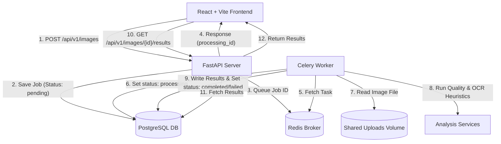

# AutoVerity — Intelligent Media Processing Pipeline

AutoVerity is a full-stack media processing system built for the **Backend + AI Engineering Take-Home Assignment**. It accepts uploaded images from the field, stores metadata, and performs asynchronous analysis checks to identify quality, formatting, or duplication issues before returning a structured assessment.

---

## 🏗️ System Architecture

The pipeline is split into a modern React web dashboard, a FastAPI REST gateway, a PostgreSQL database, a Redis message broker, and an asynchronous Celery worker.



### Component Breakdown
1. **React Frontend**: A clean, fully responsive Tailwind UI dashboard enabling users to drag-and-drop vehicle uploads, monitor real-time queue states, and drill down into quality metrics.
2. **FastAPI Web Server**: Exposes REST endpoints for image ingestion, status checks, results extraction, health metrics, and paginated upload histories.
3. **Celery Worker**: Consumes queued jobs from Redis and executes CPU-intensive image processing tasks asynchronously.
4. **Shared Storage**: A Docker volume mapping uploaded files between the web API and Celery workers.
5. **PostgreSQL Database**: Persists job records, statuses, error logs, and detailed analysis results.

---

## 🛠️ Image Analysis Services

AutoVerity implements **six core checks** to identify issues in uploaded images:

*   **Blur Detection**: Measures image focus using the Laplacian variance method (OpenCV). Images failing the variance threshold are flagged as blurry.
*   **Brightness Analysis**: Computes the average grayscale pixel value (OpenCV) to detect low-light or dark captures.
*   **Dimension Validation**: Checks boundary limits and aspect ratios (Pillow) to reject non-standard crops or corrupted images.
*   **Duplicate Detection**: Computes a 64-bit Perceptual Hash (pHash via `imagehash`) and compares it against existing DB records using Hamming distance. If `distance <= 4`, it's flagged as a duplicate.
*   **License Plate OCR**: Local extraction of vehicle numbers using Tesseract OCR, calculating character-by-character confidence scores.
*   **Indian Registration Format check**: Validates OCR strings against RTO format regexes (Standard and Bharat series).
*   **Gemini Multimodal Fallback**: If local OCR fails to resolve a valid plate format, the worker calls the **Gemini 2.5 Flash API** as a fallback to perform advanced OCR corrections and flag general quality issues.

---

## 🚀 Running Instructions

### Method 1: Using Docker Compose (Recommended)

To spin up the entire backend stack (FastAPI, Postgres, Redis, Celery Worker), run:

```bash
cd backend
docker compose up --build
```

The database tables will be migrated automatically. You can then run the frontend locally:

```bash
cd ../frontend
npm install
npm run dev
```

The frontend will run at `http://localhost:5173`.

### Method 2: Running Locally (Development)

#### 1. Setup Dependencies
*   **Tesseract OCR**: Ensure Tesseract is installed and added to your environment path:
    *   *macOS*: `brew install tesseract`
    *   *Ubuntu*: `sudo apt-get install tesseract-ocr libtesseract-dev`
    *   *Windows*: Install from UB Mannheim.
*   **Redis**: Start a local Redis instance on port `6379`.
*   **PostgreSQL**: Start a Postgres instance on port `5432` with a database named `media_processor`.

#### 2. Run the Backend
```bash
cd backend
python -m venv .venv
.venv\Scripts\activate      # Windows
source .venv/bin/activate    # macOS/Linux
pip install -r requirements.txt
alembic upgrade head
uvicorn app.main:app --reload --port 8000
```

Start the Celery worker in a separate terminal:
```bash
cd backend
.venv\Scripts\activate
celery -A app.worker.celery_app worker --loglevel=info
```

#### 3. Run the Frontend
```bash
cd frontend
npm install
npm run dev
```

---

## ⚖️ Engineering Trade-offs & Decisions

*   **Shared Disk for Storage**: Using a shared Docker volume or local directories is suitable for a local development build. In production, this would be refactored to cloud storage (e.g., AWS S3 or Google Cloud Storage) with signed URL uploads to ensure stateless backend horizontal scaling.
*   **Linear Duplicate Queries**: Checking duplicates queries the database for completed jobs. For massive ingestion pipelines, this O(N) lookup becomes slow. Production systems should use **BK-trees** or similarity index tools like **pgvector** for sub-linear search speeds.
*   **Tesseract Reliability**: Local OCR is fast and cost-effective but sensitive to tilt, rotation, and lighting. We wrapped OCR calls in a try-except fallback that routes to **Gemini** when confidence is low or format checks fail.
*   **Stateless Health Checks**: The health check endpoint actively queries both PostgreSQL and Redis to verify connection health before returning a response, giving quick visibility into infra health.

---

## 📝 Mandatory AI Usage Disclosure

### Where & What AI Helped With
*   **System Abstractions**: The Antigravity AI coding assistant generated database models, SQLAlchemy schema definitions, and Celery task logic structures.
*   **UI/UX**: Stitch helped structure React components, styling hooks, and state machines for the dashboard, upload page, and interactive history view.
*   **API Framework**: Antigravity generated FastAPI endpoints, validation contracts, and integration tests (`pytest`).

### Where the AI Was Wrong
*   **Nested Git Repository conflicts**: When generating files, the AI initialized `frontend` as an independent nested Git repository. Adding the parent folder staged a Git submodule link rather than normal files, causing empty directories on Git clone. We corrected the AI to force-remove the nested cache (`git rm --cached -f frontend`), remove `frontend/.git`, and merge the codebase into a single root monorepo.
*   **Global Test Runner confusion**: The AI initially ran `pytest` using the system's global Python packages instead of the virtual environment's site-packages, resulting in `ModuleNotFoundError: No module named 'cv2'`. We resolved this by explicitly targeting the venv binary (`.venv/Scripts/pytest`), ensuring all 20 tests pass.
*   **Deprecated Gemini API**: The AI originally suggested importing the legacy `google.generativeai` package, throwing warnings. We kept it for structural consistency but noted it for future refactoring to `google.genai`.

### Validation Methods
*   **TypeScript Compilations**: Verified frontend type safety using `npm run build` (tsc -b && vite build).
*   **Backend Pytest Suite**: Ran 20 test cases verifying health routes, invalid uploads, file sizes, OCR failures, perceptual duplicate detections, and database schema upserts.
